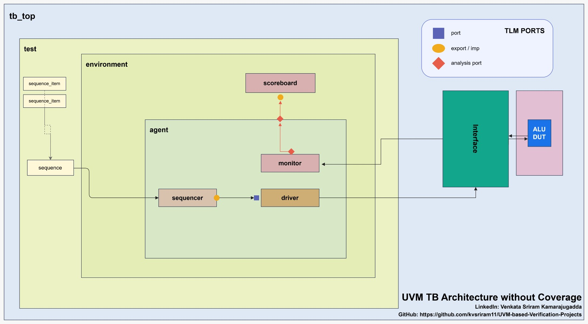

# ALU Verification using UVM (ALU-v1)


This project demonstrates the verification of an 8-bit Arithmetic Logic Unit (ALU) using the Universal Verification Methodology (UVM).

Version **ALU-v1** focuses on building a clean UVM testbench from scratch, implementing self-checking mechanisms, and handling real-world verification challenges such as pipeline latency and simulation synchronization.

---

## Overview

The ALU supports the following operations:

| Opcode | Operation        |
|--------|------------------|
| 0000   | Addition (a + b) |
| 0001   | Subtraction      |
| 0010   | Multiplication   |
| 0011   | Division         |

### Inputs
- `a` : 8-bit input  
- `b` : 8-bit input  
- `alu_sel` : 4-bit opcode  
- `reset`, `clock`

### Outputs
- `alu_out` : 8-bit result  
- `carryout` : carry flag  

---

## Key Features (ALU-v1)

- Complete UVM testbench architecture  
- Sequence-driven randomized stimulus generation  
- Self-checking scoreboard  
- Transaction-level modeling using TLM (analysis ports)  
- Handling synchronous DUT latency (1-cycle delay)  
- Pass/Fail tracking with final summary report  
- Controlled simulation using UVM objections  

---

## Test Execution Summary

- Total randomized testcases: **20**
- All transactions verified using scoreboard comparison  
- Final summary printed at end of simulation  

Example Output:

```text
=====================================
TOTAL TEST CASES = 20
PASSED           = 20
FAILED           = 0
=====================================
```

---

## DUT Architecture

<p align="center">
  
</p>

### Notes
- Synchronous design (clocked)
- Output is registered
- Result appears 1 clock cycle after input application

---

## UVM Testbench Architecture

<p align="center">
  
</p>

### Flow

1. Sequence generates transactions  
2. Sequencer sends transactions to driver  
3. Driver drives DUT inputs via interface  
4. Monitor samples DUT inputs and outputs  
5. Scoreboard computes expected result and compares  

---

## Important Design Insights

### 1. Pipeline Latency Handling

The DUT introduces a 1-cycle delay:

```
Input at cycle N → Output at cycle N+1
```

#### Issue Faced
- Initial mismatch between expected and actual outputs  

#### Solution
- Monitor aligns input transaction with next cycle output  
- Ensures correct pairing for scoreboard comparison  

---

### 2. Simulation Synchronization Issue

#### Issue Faced
- Simulation ended before all transactions were verified  
- Scoreboard reported fewer testcases than generated  

#### Root Cause
- `phase.drop_objection()` was called before all transactions propagated  

#### Solution
- Ensured sufficient simulation time after sequence execution  
- Allowed monitor and scoreboard to process all transactions before ending simulation  

---

## 📁 Directory Structure

```text
ALU-v1/
├── rtl/
│   ├── alu.v
│   └── README.md
├── tb/
│   ├── alu_pkg.sv
│   ├── alu_if.sv
│   ├── alu_packet.sv
│   ├── alu_base_sequence.sv
│   ├── alu_test_sequence.sv
│   ├── alu_seqr.sv
│   ├── alu_drv.sv
│   ├── alu_monitor.sv
│   ├── alu_agent.sv
│   ├── alu_scb.sv
│   ├── alu_env.sv
│   ├── alu_test.sv
│   ├── top.sv
│   └── README.md
├── run.do
└── images/
    ├── alu_dut.png
    └── uvm_tb_architecture.png
```

---

## Sample Output

```text
[DRV] Driving packet: a=13 b=3 op_code=2
[MON] Sampled packet: a=13 b=3 result=39
[SCB] Transaction passed: ACT=39, EXP=39
```

---

## Current Limitations

- Functional coverage not yet implemented  
- No assertions (SVA) added  
- Carry-out signal not verified  
- Limited corner-case exploration  

---

## Future Improvements (ALU-v2)

- Add functional coverage using `uvm_subscriber`  
- Add assertion-based verification  
- Introduce constrained random corner testing  
- Coverage-driven verification  
- Extend ALU operations  

---

## License

This project is licensed under the MIT License.

MIT License

Copyright (c) 2026 Venkata Sriram Kamarajugadda

Permission is hereby granted, free of charge...

---

## Author

**Venkata Sriram Kamarajugadda**  
Master’s in Electrical & Computer Engineering  
Portland State University  

---

## Notes

This project is part of a structured effort to build strong fundamentals in UVM-based design verification and move towards industry-level verification practices.
