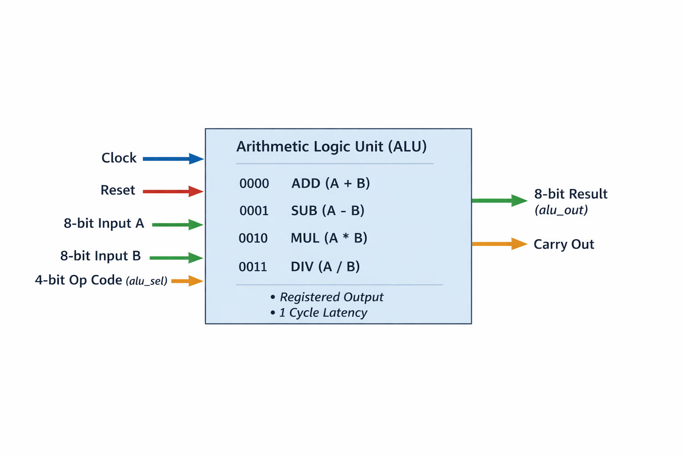

# ALU RTL Design (ALU-v1)

This directory contains the RTL implementation of an 8-bit Arithmetic Logic Unit (ALU).

The design is written in Verilog and serves as the Device Under Test (DUT) for UVM-based verification.

---

## Overview

The ALU performs arithmetic operations based on a 4-bit control signal (`alu_sel`).

---

## DUT Architecture

<p align="center">
  
</p>

---

## Supported Operations

| Opcode | Operation        |
|--------|------------------|
| 0000   | Addition (a + b) |
| 0001   | Subtraction      |
| 0010   | Multiplication   |
| 0011   | Division         |
| Others | Default (0xFF)   |

---

## Inputs

- `clock`   : System clock  
- `reset`   : Active-high reset  
- `a`       : 8-bit input operand  
- `b`       : 8-bit input operand  
- `alu_sel` : 4-bit operation select  

---

## Outputs

- `alu_out`  : 8-bit result  
- `carryout` : Carry flag  

---

## Design Details

- The ALU is a **synchronous design**
- Output is **registered on the clock edge**
- Uses combinational logic to compute intermediate results
- Final output is updated on the next clock cycle

---

## Timing Behavior

- Inputs are sampled at the clock edge  
- Output is produced after **1 clock cycle delay**

```
Inputs at cycle N → Output at cycle N+1
```

---

## Carryout Behavior (Important Note)

The `carryout` signal is currently derived from:

```verilog
assign tmp = {1'b0, a} + {1'b0, b};
carryout <= tmp[8];
```

### Implication

- Carry is always computed from **a + b**
- It does **not depend on the selected operation (`alu_sel`)**

### Meaning

- Correct only for **addition**
- Not valid for subtraction, multiplication, or division

---

## Limitations (ALU-v1)

- No divide-by-zero protection  
- Carry flag is not operation-aware  
- Multiplication result is truncated to 8 bits  
- No overflow handling  
- No status flags (zero, negative, overflow)

---

## File

```
alu.v
```

---

## Purpose

This RTL is used as a DUT for:

- UVM-based functional verification  
- Debugging synchronous timing behavior  
- Learning RTL design and verification integration  

---

## Future Improvements (ALU-v2)

- Make `carryout` operation-aware  
- Add divide-by-zero protection  
- Add overflow and status flags  
- Improve arithmetic accuracy (wider result handling)

---

## Author

**Venkata Sriram Kamarajugadda**  
Master’s in Electrical & Computer Engineering  
Portland State University  
